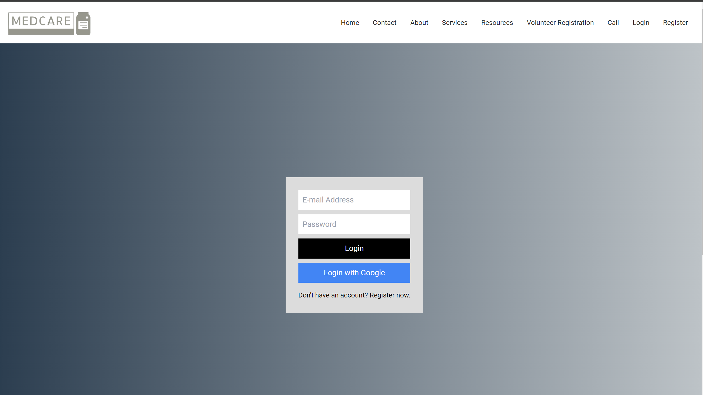
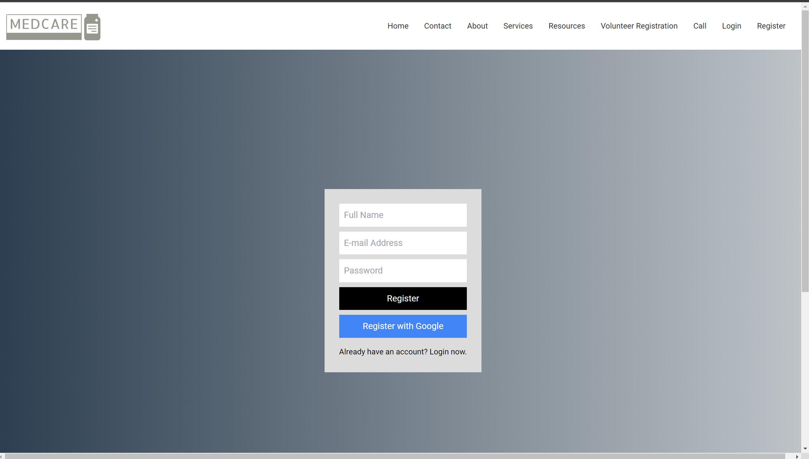
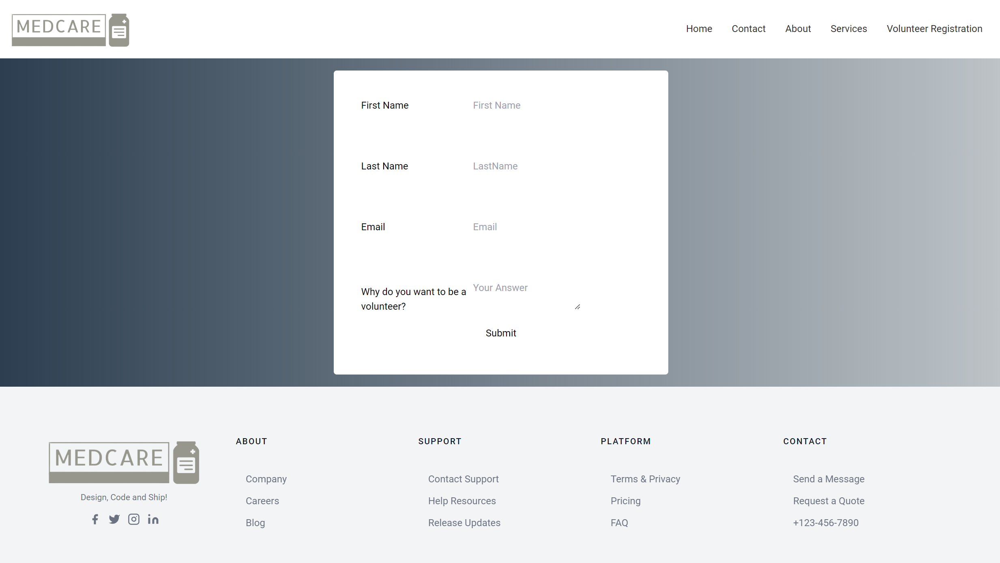
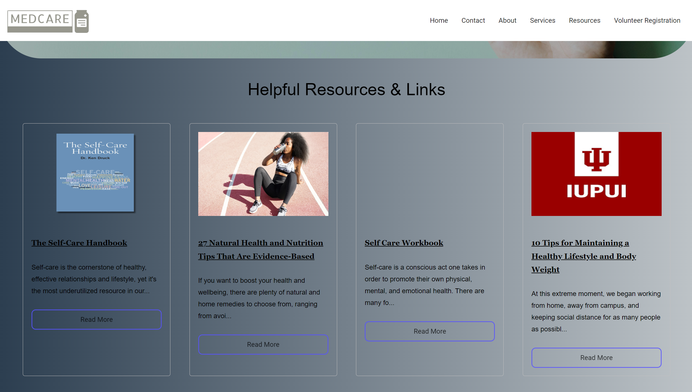
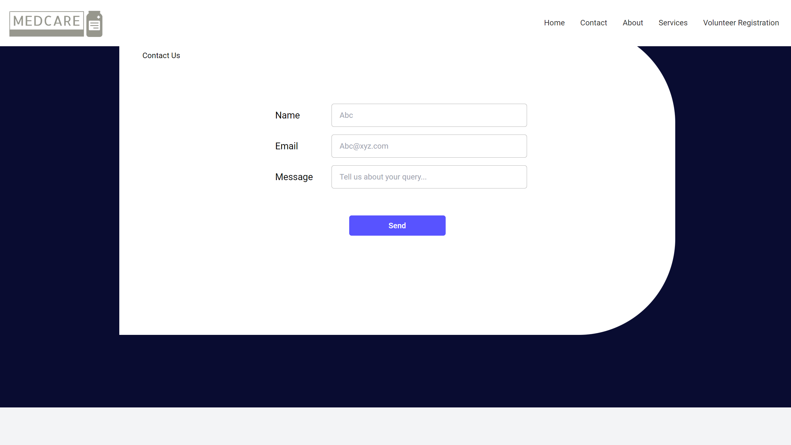

<h1 align="center" > MedCare </h1> 

MedCare is an online platform designed to provide comprehensive healthcare services and resources to users, empowering them to manage their health effectively. Our mission is to make healthcare accessible, informative, and engaging for everyone.

You can also check out the live demo of the website [here](https://project1-one-lovat.vercel.app/).

## Snapshots








## Project Setup

**Clone the project**

```bash
  git clone <https://link-to-project>
```

**Go to the project directory**

```bash
  cd <myProject>
```

**Install dependencies**

```bash
  npm install
```

### Rename the .env.example file to .env file in the root directory and add the values for the environment variables
```bash
REACT_APP_API_KEY="YOUR_API_KEY"
REACT_APP_AUTH_DOMAIN="YOUR_APP_AUTH_DOMAIN"
REACT_APP_PROJECT_ID="YOUR_APP_PROJECT_ID"
REACT_APP_STORAGE_BUCKET="YOUR_APP_STORAGE_BUCKET"
REACT_APP_MESSAGING_SENDER_ID="YOUR_APP_MESSAGING_SENDER_ID"
REACT_APP_MESSAGING_APP_ID="YOUR_APP_MESSAGING_APP_ID"
REACT_APP_MEASUREMENT_ID="YOUR_APP_MEASUREMENT_ID"
```
### You can refer a tutorial on how to get the firebase credentials [here](https://www.youtube.com/watch?v=ZTHdCMj3jP8)

**Start the server**

```bash
  npm start
```

# Features to be Implemented

- [ ] Design a clean and intuitive interface that is easy to navigate, ensuring users can quickly find the information or services they need.
- [ ]  Implement secure user accounts for personalized experiences, allowing users to manage their health records, appointments, and preferences.
- [ ] Provide an online appointment scheduling system for various healthcare services, allowing users to book appointments with doctors, diagnostic labs and other medical professionals.
- [ ] Medication Tracker and Reminders
- [ ] Provide a section with reliable health information, articles, videos, and interactive content to educate users on various medical topics.
- [ ] Mental Health Support
- [ ] Establish community forums where users can share experiences, seek advice, and participate in discussions related to health and wellness.
- [ ] Implement gamification features, encouraging users to participate in health challenges and rewarding them for adopting healthier habits.
- [ ] Multilingual Support

# Contributing Guidelines

Before you start contributing, please take a moment to read the following guidelines to ensure a smooth and effective contribution process.

## Table of Contents


1. [How Can I Contribute?](#how-can-i-contribute)
    - [Reporting Bugs](#reporting-bugs)
    - [Suggesting Enhancements](#suggesting-enhancements)
    - [Working on Issues](#working-on-issues)
    - [Submitting Pull Requests](#submitting-pull-requests)


## How Can I Contribute?

### Reporting Bugs

If you find a bug, please ensure the bug was not already reported by searching on GitHub under [Issues](https://github.com/BTANISHA11/medcare/issues). If you can't find an existing issue addressing the problem, please [open a new issue](https://github.com/BTANISHA11/medcare/issues/new) and provide detailed information about the bug.

### Suggesting Enhancements

If you have an idea for an enhancement, we welcome your input. Before creating a new enhancement issue, please check the existing issues to see if your enhancement idea has already been discussed. If it hasn't, [create a new issue](https://github.com/BTANISHA11/medcare/issues/new) and outline your enhancement proposal.

### Working on Issues

Feel free to pick any open issue from our [issue tracker](https://github.com/BTANISHA11/medcare/issues) that you find interesting. Comment on the issue that you would like to work on it so that others are aware you are addressing it. If you need more context on a particular issue, please ask for clarification.

### Submitting Pull Requests

1. Fork the repository and create your branch from `main`: `git checkout -b your-branch-name`
2. Make your changes and test thoroughly.
3. Add, commit, and push your changes to your forked repository.
4. Create a pull request to the `main` branch of the original repository.
5. Clearly describe your changes and why you think they should be merged.
6. Be willing to make any requested changes or improvements.

Thank you for contributing! 🚀


<h3 align="center" > Together, we can make Medcare even more effective in addressing healthcare accessibility challenges worldwide.</h3>
